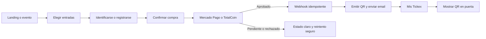
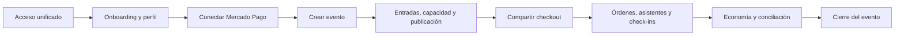
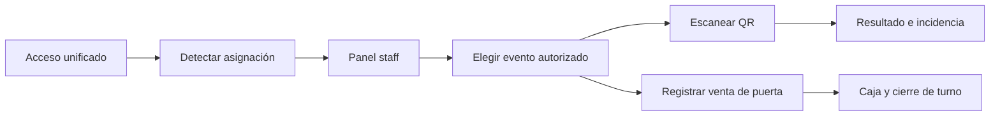
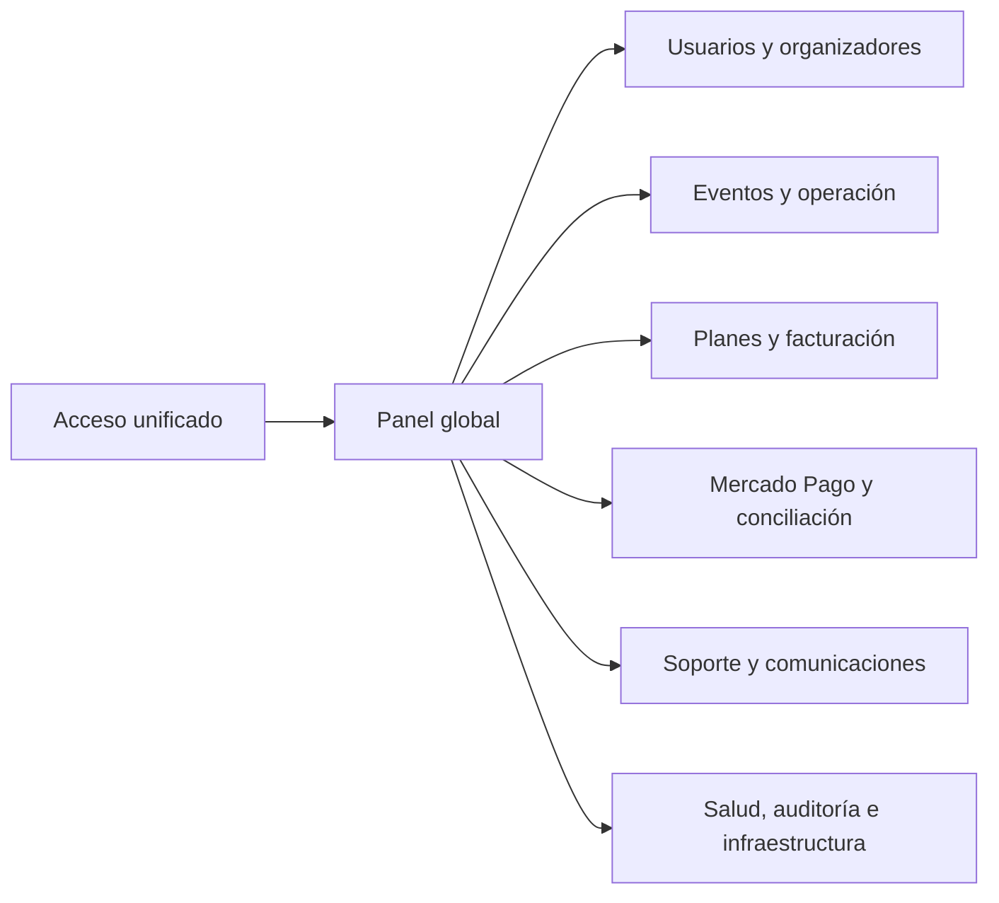

# Tickex — auditoría integral de funcionamiento y experiencias

Fecha: 9 de septiembre de 2026  
Código auditado: `5d05fd63c568ab0e07884f7a71b42bd03d58e5cd`

## Resultado ejecutivo

Tickex está técnicamente estable para continuar las pruebas controladas: la base, el código, los permisos por rol, los enlaces internos y las pruebas automatizadas no mostraron regresiones. Todavía no corresponde considerar cerrado el lanzamiento comercial porque faltan validar con dinero real el ciclo completo de Mercado Pago, probar correo bajo concurrencia, hacer una pasada autenticada sobre producción con cada rol y completar los requisitos legales y de Play Store.

Estado general: **apto para staging y pruebas piloto; no aprobado todavía para operación masiva sin supervisión**.

## Evidencia comprobada

| Área | Local aislado | VPS / producción | Resultado |
|---|---:|---:|---|
| Sintaxis PHP | 390 archivos | 390 archivos | 0 errores |
| Suite automatizada | 64 pruebas | 64 pruebas sobre copia de la base | 64 aprobadas |
| Integridad SQLite | Sí | Sí, sobre copia | `ok` |
| Enlaces públicos | 17 rutas y 73 enlaces internos | 17 rutas | Sin enlaces rotos propios |
| Enlaces literales del código | 157 destinos | Mismo código | Ningún destino faltante |
| Superadmin autenticado | 160 rutas GET | No se usaron credenciales reales | Sin errores en local |
| Organizador autenticado | 160 rutas GET | No se usaron credenciales reales | Sin errores en local |
| Comprador autenticado | 10 rutas GET | No se usaron credenciales reales | Sin errores en local |
| Staff / puerta autenticado | 13 rutas GET | No se usaron credenciales reales | Permisos aplicados |
| Archivos sensibles públicos | N/A | SQLite 404; logs 403; pruebas, secretos y código interno 404 | Protegidos |
| Cabeceras de seguridad | N/A | CSP, HSTS, `nosniff`, `SAMEORIGIN`, política de cámara, no-cache | Correctas |
| Cookie de sesión | N/A | `Secure`, `HttpOnly`, `SameSite=Lax` | Correcta |

La salida a Google desde el entorno local fue bloqueada por el aislamiento de red del auditor. El código del flujo está cubierto por pruebas, pero el acceso real con Google debe repetirse en producción con cada tipo de cuenta.

## Experiencias de usuario

### 1. Comprador

Comprobado:

- El acceso unificado dirige al comprador a `Mi cuenta`.
- El panel separa próximas, utilizadas, anteriores, canceladas y archivadas.
- Las rutas privadas redirigen al login cuando no hay sesión.
- La emisión, el stock y la idempotencia están cubiertos por pruebas.

Pendiente antes de escalar:

- Comprar una entrada real mínima y observar aprobado, pendiente, rechazo, devolución y contracargo.
- Confirmar que el comprador nunca recibe QR duplicados ante reintentos.
- Mejorar el estado vacío con un acceso visible a eventos disponibles.
- Probar en teléfonos reales: Google, Mercado Pago, apertura de QR, descarga, volver atrás y recuperación de contraseña.

### 2. Organizador

Comprobado:

- El organizador ve sólo sus eventos, inventario, staff y datos relacionados.
- El panel y los módulos principales cargan sin errores en el entorno aislado.
- Los eventos cliente no heredan Bridge ni TotalCoin de otros organizadores.
- Mercado Pago, planes, soporte y comunicación están integrados en la navegación.

Pendiente antes de escalar:

- Un onboarding guiado que obligue a completar cobros, identidad, contacto y evento antes de publicar.
- Conciliación diaria de Tickex contra Mercado Pago y alertas por diferencias.
- Flujo visible de devoluciones, cancelaciones y contracargos.
- Evitar que un evento sin fechas válidas se mezcle con eventos activos o agenda.

### 3. Staff / puerta

Comprobado:

- El panel muestra el rol y sólo los eventos asignados.
- Puerta puede escanear y registrar venta; una ruta de actividad no autorizada responde 403 y no se muestra como acción visible.
- No hereda privilegios de administrador ni de comprador anterior.

Mejora recomendada:

- Si la cuenta tiene un rol operativo, llevarla directamente al panel staff después del login y conservar `Mi cuenta` como opción secundaria.
- Completar caja, ventas de puerta, incidencias, responsables y cierre de turno.

### 4. Superadmin

Comprobado:

- La navegación global carga y separa administración, operaciones, finanzas, soporte e infraestructura.
- Las promociones de usuarios, el aislamiento de tenants y las operaciones sensibles tienen pruebas.
- La exposición pública de base, logs, secretos, pruebas y herramientas quedó bloqueada.

Mejoras recomendadas:

- Sacar de la agenda normal el evento histórico sin fecha o ubicarlo en `Requiere revisión`.
- Crear un tablero de excepciones: pagos sin conciliar, webhooks fallidos, emails rebotados, stock inconsistente e incidentes abiertos.
- Registrar una bitácora visible de acciones sensibles de superadmin.

## Hallazgos priorizados

### P0 — bloquean un lanzamiento comercial sin supervisión

1. Falta validar el split real de Mercado Pago con comprador, organizador y Tickex separados.
2. Falta verificar el ciclo real de webhooks: aprobado, pendiente, rechazado, devolución y contracargo.
3. Falta rotar las credenciales y sesiones históricas indicadas en el plan de seguridad.
4. Faltan textos legales/fiscales definitivos y un proceso real de eliminación de cuenta y datos.
5. Falta una prueba autenticada de producción con cuentas controladas de los cuatro roles.

### P1 — operación y escala

1. Correo: concurrencia, duplicados, rebotes, quejas, desuscripción y separación transaccional/marketing.
2. SQLite: funciona ahora, pero exige migración antes de alta concurrencia de ventas y webhooks.
3. Planes: límites, comisiones, suscripciones, mora, cambios y vencimientos deben quedar automatizados.
4. Pagos: conciliación, devoluciones y alertas operativas aún necesitan panel propio.
5. Infraestructura: retirar versiones PHP antiguas, actualizar SQLite del sistema y automatizar despliegue/rollback.

### P2 — experiencia

1. Auditoría responsive y accesible en teléfonos Android reales.
2. Redirección directa del staff a su espacio operativo (opcional: el acceso visible a `Panel staff` ya funciona).
3. Desplegar la migración preparada para fechar el evento histórico original el 15–16 de noviembre de 2025.
4. Guías contextuales y onboarding por rol.
5. Analítica del embudo: visita, selección, inicio de pago, aprobación, abandono y check-in.

## Camino más corto a Google Play

El repositorio contiene `MainActivity.kt` y un manifiesto Android, pero no contiene un proyecto Gradle completo: hoy no puede generar un `.aab` publicable. Tampoco conviene publicar esa versión sin cambios, porque carga la URL antigua `str.tickex.com.ar`, permite contenido mixto compatible, acepta cookies de terceros y mantiene cualquier URL HTTP/HTTPS dentro del WebView.

### Arquitectura recomendada

Una app Android liviana, pero no un WebView ciego:

- Kotlin + AndroidX con `targetSdk 36`.
- Dominio canónico `https://www.tickex.com.ar`.
- Lista permitida de navegación interna sólo para dominios Tickex.
- Google OAuth y Mercado Pago abiertos mediante navegador seguro / Custom Tabs, nunca dentro del WebView.
- App Links para volver a Tickex después de autenticación o pago.
- Cámara nativa para QR y selector de fotos moderno para archivos.
- HTTPS obligatorio; sin contenido mixto ni permisos concedidos genéricamente.
- Sesión, errores, carga, modo sin conexión y actualizaciones con interfaz propia.
- Funciones móviles claras —QR, escaneo, notificaciones y accesos rápidos— para que no sea percibida como una copia web de funcionalidad limitada.

Google Play exige desde el 31 de agosto de 2026 que las apps nuevas apunten a Android 16 / API 36. También exige Android App Bundle, declaración de seguridad de datos y política de privacidad. Si la cuenta personal de Play se creó después del 13 de noviembre de 2023, se necesita una prueba cerrada con al menos 12 testers durante 14 días continuos antes de solicitar producción.

### Plan de entrega

#### Fase A — preparación web

- Completar privacidad, términos y página pública para solicitar eliminación de cuenta.
- Implementar eliminación desde `Mi perfil` o un pedido verificable dentro de la app.
- Estabilizar rutas canónicas y App Links.
- Probar Google y Mercado Pago en navegador móvil real.

#### Fase B — aplicación Android

- Crear proyecto Gradle completo y paquete definitivo, por ejemplo `com.tickex.app`.
- Migrar las capacidades útiles del prototipo y endurecer la navegación.
- Incorporar íconos adaptativos, pantalla inicial, estados de error/carga y versión.
- Generar APK de prueba y AAB firmado mediante Play App Signing.
- Probar comprador, organizador y staff en varios tamaños y versiones Android.

#### Fase C — Play Console

- Crear ficha, categoría, contacto, descripción, ícono, banner y capturas reales.
- Completar acceso de revisión con cuentas demo válidas para cada rol relevante.
- Completar clasificación de contenido, audiencia, anuncios, privacidad y Data Safety.
- Publicar primero en prueba interna y luego en prueba cerrada.
- Reunir los 12 testers por 14 días si la cuenta está alcanzada por esa regla.
- Corregir informes de Android Vitals y solicitar acceso a producción.

## Criterio de salida

La publicación puede considerarse lista cuando:

- el AAB compila reproduciblemente y apunta a API 36;
- Google, Mercado Pago, cámara, QR, archivos y enlaces de retorno funcionan en dispositivos reales;
- no hay fallas críticas en Android Vitals ni rutas rotas;
- privacidad, eliminación de cuenta y Data Safety coinciden con el comportamiento real;
- Play Console dispone de credenciales demo y material gráfico fiel;
- la prueba cerrada requerida está completada;
- y los P0 de pagos, seguridad y legales están cerrados.

## Fuentes oficiales de Play Store

- [Requisitos de API objetivo](https://support.google.com/googleplay/android-developer/answer/11926878?hl=es-419)
- [Pruebas exigidas a cuentas personales nuevas](https://support.google.com/googleplay/android-developer/answer/14151465?hl=es)
- [Seguridad de datos](https://support.google.com/googleplay/android-developer/answer/10787469)
- [Eliminación de cuentas](https://support.google.com/googleplay/android-developer/answer/13327111)
- [Android App Bundle](https://developer.android.com/guide/app-bundle)
- [Política OAuth sobre navegadores embebidos](https://developers.google.com/identity/protocols/oauth2/policies)
- [Funcionalidad y experiencia mínima](https://support.google.com/googleplay/android-developer/answer/9898783)
